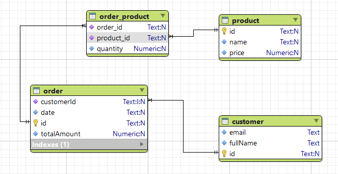
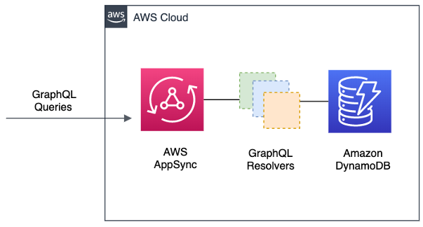
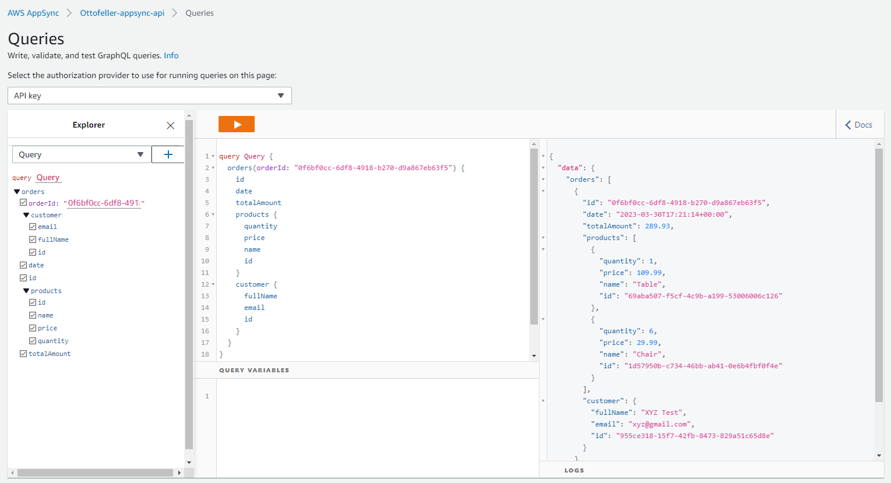

# Description

The project defines the **GraphQL API** to be used for fetching data related to the Orders created and stored in a DynamoDB database.

The database has 3 tables: **Customer**, **Product** and **Order**.

The Order table consolidates information regarding who is buying and what is being bought. So, a list of products is stored along with the other information.

The tables, considering the **relational model**, follow the structures below:


The Project was written using the language **Typescript v5.0.2** and use **AWS CDK** to create the stack on the AWS Environment.

The stack has the basic structure presented below:


## Preparing the Development and Test Environment
### Installation
You must have the following technologies installed on your machine to be able to work on the project:
* [AWS CLI](https://docs.aws.amazon.com/cli/latest/userguide/install-cliv2.html)
* [npm](https://www.npmjs.com/get-npm)
* [VS Code](https://code.visualstudio.com/Download) or another IDE

### Configuration
To test the project in the development environment, you must have the AWS CLI configured on your machine, which is the client to publish the project as a stack via AWS Cloudformation. To do this, you need, with the AWS CLI already installed, open a command prompt and type the following command, answering the questions then as shown in the example below, as instructed in [official docs](https://docs.aws.amazon.com/cli/latest/userguide/cli-configure-files.html):

```bash
$ aws configure
AWS Access Key ID [None]: ********************
AWS Secret Access Key [None]: ****************************
Default region name [None]: us-east-2
Default output format [None]: json
```

## Deployment Procedures
This project is composed of source code written in Typescript and exposes 1 endpoint in a GraphQL Api using **AWS AppSync**.

To deploy the stack in **dev**, just run the following command from the command prompt inside the project's root directory.

```bash
$ npm run build && npm run deploy
```

To destroy the stack, just run the following command from the command prompt inside the project's root directory.

```bash
$ npm run destroy
```

## How to use
For fetching an Order list we can use the GraphQL body below. The argument orderId is Optional.

* **INPUT**
  ```GraphQL
  query Query {
    orders(orderId: String) {
      id
      date
      totalAmount
      products {
        quantity
        price
        name
        id
      }
      customer {
        fullName
        email
        id
      }
    }
  }
  ```

* **OUTPUT**
  ```JSON
  {
    "data": {
      "orders": [
        {
          "id": "0f6bf0cc-6df8-4918-b270-d9a867eb63f5",
          "date": "2023-03-30T17:21:14+00:00",
          "totalAmount": 289.93,
          "products": [
            {
              "quantity": 1,
              "price": 109.99,
              "name": "Table",
              "id": "69aba507-f5cf-4c9b-a199-53006006c126"
            },
            {
              "quantity": 6,
              "price": 29.99,
              "name": "Chair",
              "id": "1d57950b-c734-46bb-ab41-0e6b4fbf0f4e"
            }
          ],
          "customer": {
            "fullName": "XYZ Test",
            "email": "xyz@gmail.com",
            "id": "955ce318-15f7-42fb-8473-829a51c65d8e"
          }
        }
      ]
    }
  }
  ```

You can use Postman or other API Platform for running the cURL below:

```cURL
curl --location --request POST 'https://xxx.appsync-api.us-east-2.amazonaws.com/graphql' \
--header 'Authorization: ...' \
--header 'Content-Type: application/json' \
--header 'x-api-key: da2-...' \
--data-raw '{"query":"query Query {\r\n  orders(orderId: \"0f6bf0cc-6df8-4918-b270-d9a867eb63f5\") {\r\n    id\r\n    date\r\n    totalAmount\r\n    products {\r\n      quantity\r\n      price\r\n      name\r\n    }\r\n    customer {\r\n      fullName\r\n      email\r\n    }\r\n  }\r\n}","variables":{}}'
```

The **GraphQL API URL** is exported once you have deployed the stack to AWS as well as the **API Key**.

The other possibility is to use the **AWS AppSync Query tool**:


## Final Considerations
For now, there is no pagination and sorting mechanisms implemented.

The **data for initial load** of the tables can be found on the **initial_data** folder that is in the project's root directory.